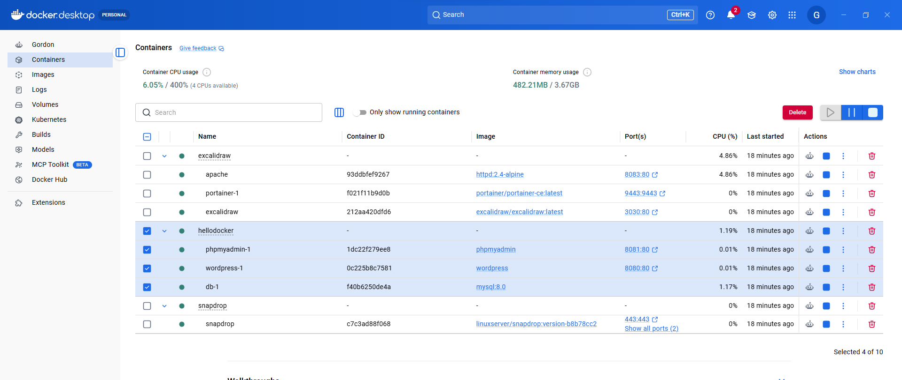
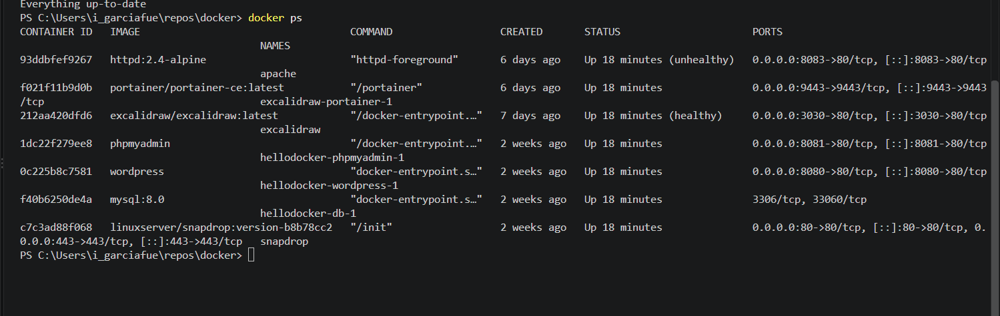
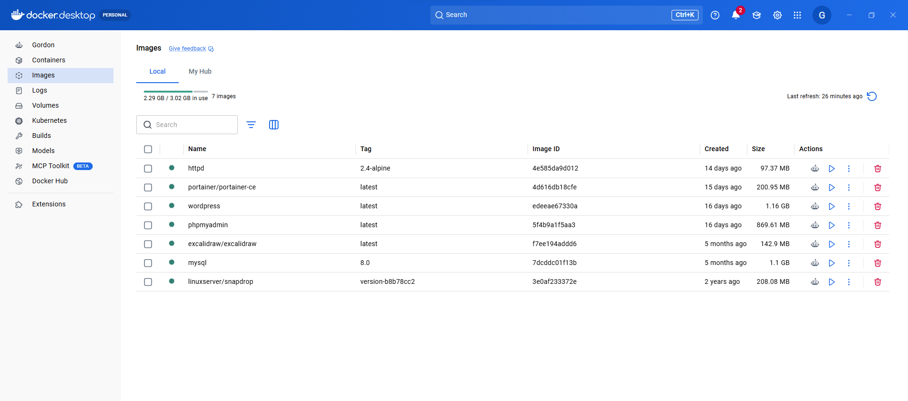
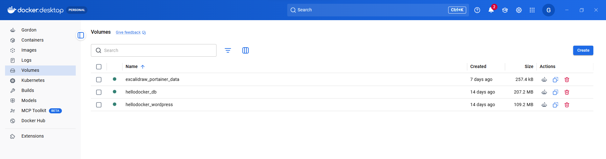
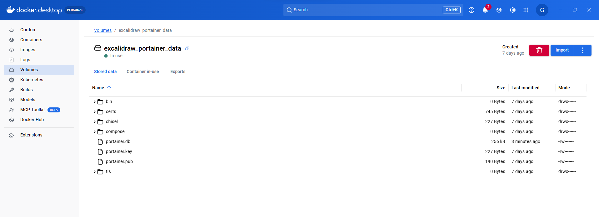
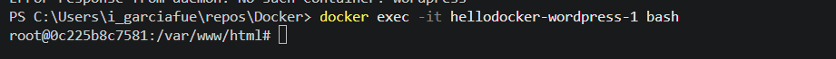
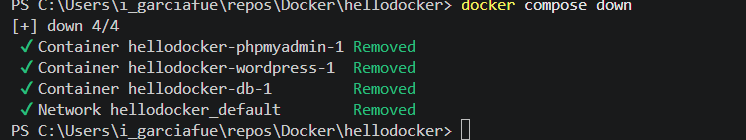

# Explora Docker

En esta práctica vamos a explorar tanto la aplicación Docker Desktop de windows y los comando más utilizados de Docker.

- [Explora Docker](#explora-docker)
  - [Indicaciones de entrega](#indicaciones-de-entrega)
  - [Antes de empezar](#antes-de-empezar)
  - [1. Contenedores](#1-contenedores)
  - [2. Imagenes](#2-imagenes)
  - [3. Volumenes](#3-volumenes)
  - [4. Administrando contendores](#4-administrando-contendores)


## Indicaciones de entrega

- Responde en este fichero con capturas o texto según se requiera.
- Utiliza el formato correcto para los bloques de comando si los hubiera
- Recuerda ir publicando los cambios de vez en cuando usando los comandos, ejemplo:
```bash
git add --all
git commit -m "ejericicios 2, 3, 4 y 5"
git push
```

## Antes de empezar

- Pon Docker en marcha y ejecuta el comando de docker compose en esta carpeta para levantar la maquina. 
```bash
docker-compose up -d
```

## 1. Contenedores

1.1 ¿ Dónde podemos ver los contendores en marcha en la aplicación Docker Desktop? (Captura)


1.2 Para ver los contendores en marcha desde la terminal se usa el comando `docker ps`, ejecutalo. (Captura)


1.4 ¿Qué muestra el comando `docker container`?
<b>Comandos qu se pueden llegar a usar para los conteiners </b>

1.5 ¿Qué muestra el comando `docker container ls`? <b> Muestra los conteners, cuando se crearon, los puertos el estado

## 2. Imagenes

2.1 ¿Dónde podemos ver las imágenes que tenemos descargadas en la aplicación Docker Desktop? (Captura)

2.2 ¿Qué muestra el comando `docker images`?
<b>Muestra las imagenes descargadas </b>

2.3 ¿Qué muestra el comando `docker image ls`
<b> Lo mismo que arriba </b>
## 3. Volumenes

3.1 ¿Dónde podemos ver los volumenes que tenemos en la aplicación Docker Desktop? (Captura)


3.2 ¿Qué vemos en Docker Desktop si entramos en uno de los volumenes disponibles? (Captura)

3.3 ¿Qué muestra el comando `docker volume`?
<b>Muesrea comandos para crear volumenes </b>
3.4 ¿Qué muestra el comando `docker volume ls`?
<b>Muestra los nombres de lo volumenes </b>
## 4. Administrando contendores

4.1 Si entramos en un contendor, verémos las siguientes pestañas. Las más importantes son **Logs**, **Exec** y **Files**. Explica para qué crees que sirve cada una.


4.2 Si queremos ejecutar comandos dentro de un contendor podemos usar Docker Desktop o podemos utilizar el comando `docker exec`. 

Para abrir una terminal, podemos ejecutar el programa bash con el parámetro -it (t de terminal e i de Standard Input).


```bash
docker exec -it <NOMBRE CONTENDOR> bash
```

Ejecuta el comando y muestra una captura de la terminal dentro del contendor.


4.3 Apaga todos los contendores de este proyecto con el comando `docker compose down` (Captura)
